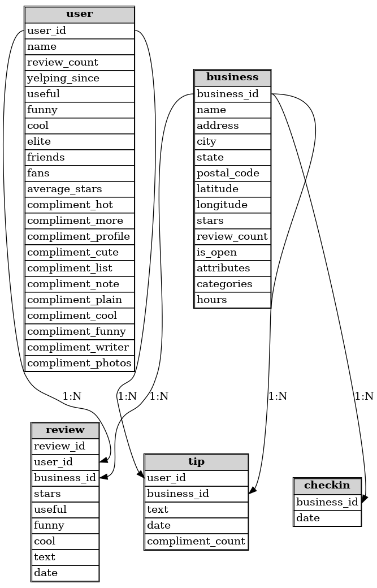
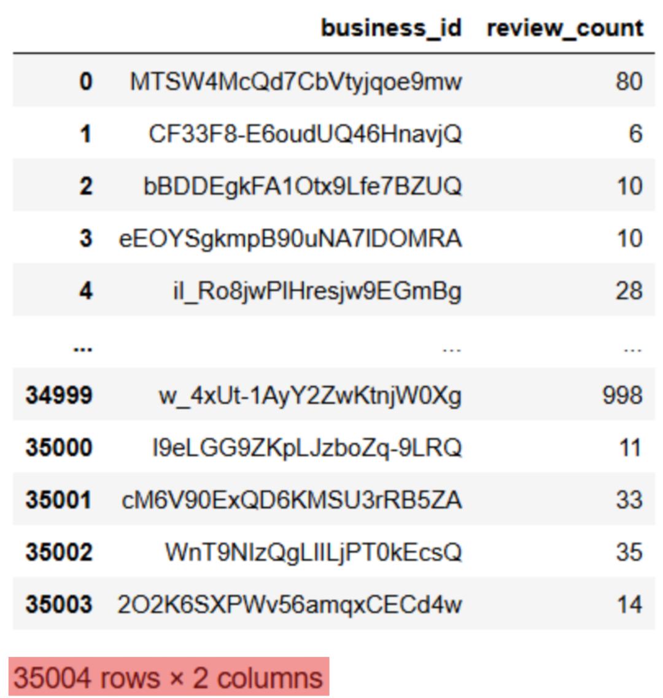
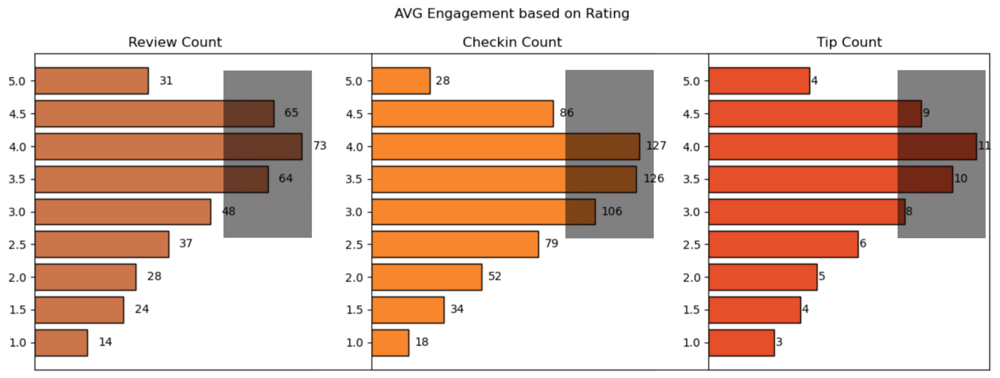
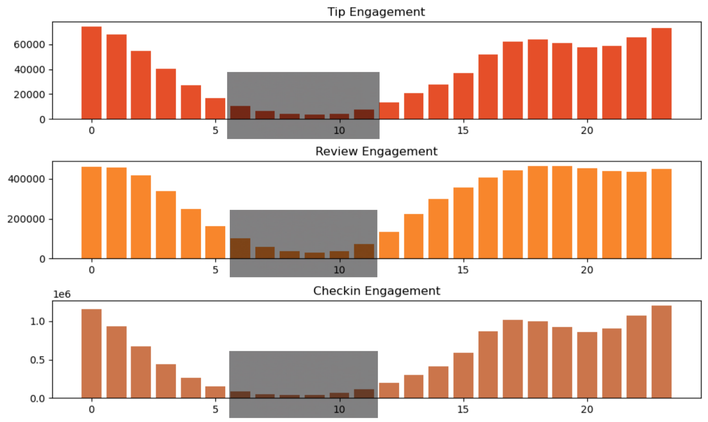
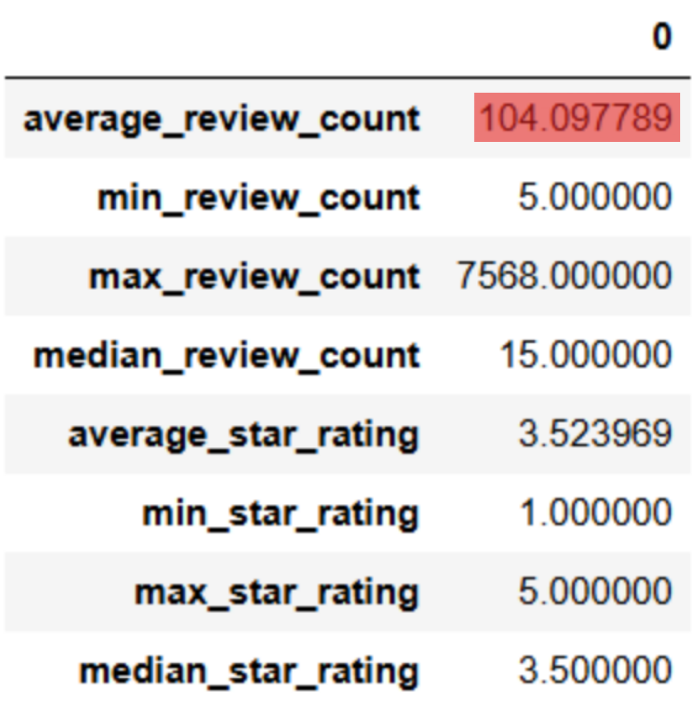
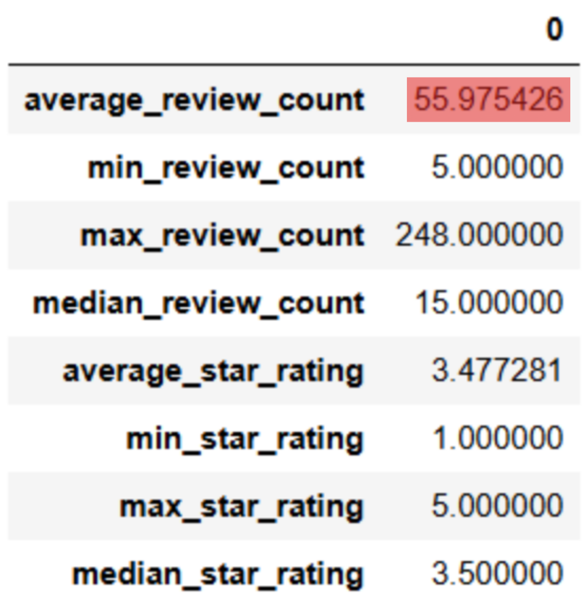
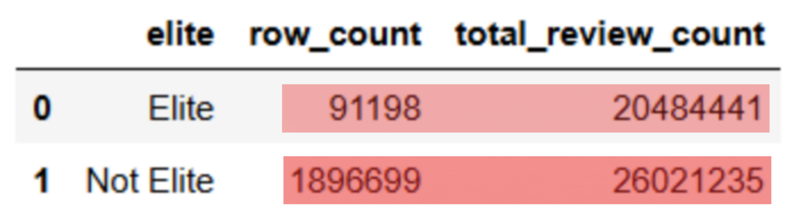
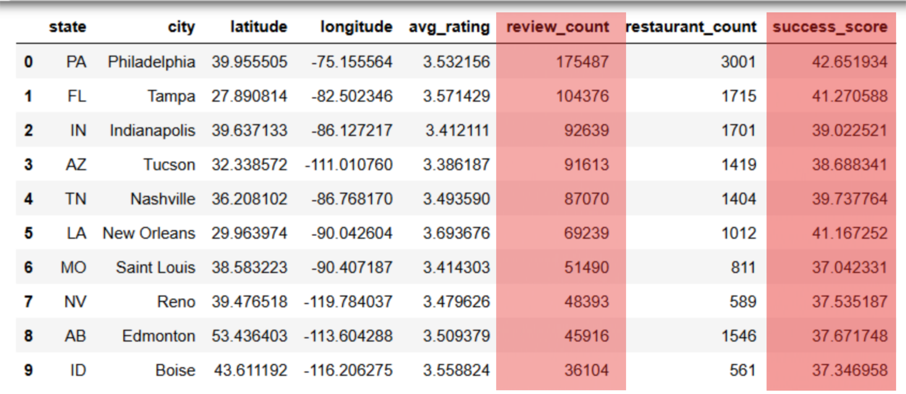

<p align="center">
  
</p>

# Yelp Restaurant Success Analysis: Data-Driven Strategies for Growth

## Project Overview
<details open>
<summary><strong><span style="font-size: 1.25em;">Project Overview</span></strong></summary>

In today’s competitive restaurant landscape, customer engagement is not just a metric—it’s a growth driver. This project explores how user interactions on Yelp—such as `reviews`, `check-ins`, `tips`, sentiment, and elite user activity—correlate with restaurant success.

By analyzing a large dataset of customer activity, the project uncovers patterns that influence ratings, visibility, and long-term performance. It reveals how and `when` customers engage most, `which` cities show the highest potential, and `how` elite users impact reputation and reach.

The project delivers actionable insights and strategic recommendations that `restaurant owners` and `marketing team` can use to improve customer experience, increase engagement, and identify high-potential locations for expansion.

</details>

## Table of Contents

- [Research Objectives](#research-objectives)
- [Hypotheses](#hypotheses)
- [Dataset Overview](#dataset-overview)
- [Data Loading and Issues](#data-loading-and-issues)
- [Entity-Relationship Diagram](#entity-relationship-diagram)
- [Technologies Used](#technologies-used)
- [General Insights](#general-insights)
- [Strategic Insights](#strategic-insights)
- [Recommendations](#recommendations)
- [Folder Structure](#folder-structure)
- [Deliverables](#deliverables)
- [Future Work](#future-work)
- [Acknowledgments](#acknowledgments)
- [Contact](#contact)

---

<details>
<summary id="research-objectives"><strong>Research Objectives</strong></summary>

- Quantify the correlation between user engagement (reviews, tips, check-ins) and restaurant ratings or review counts.
- Analyze the impact of feedback sentiment ("useful", "funny", "cool") on average star ratings and user engagement.
- Assess whether sustained engagement over time is a more reliable indicator of long-term success than short bursts of activity.

</details>

---

<details>
<summary id="hypotheses"><strong>Hypotheses</strong></summary>

- Increased user interaction leads to greater visibility and potentially better ratings.
- Feedback sentiment metrics (e.g., "useful", "funny", "cool") significantly influence a restaurant’s performance and exposure.
- Long-term, consistent engagement is more indicative of sustained success than temporary spikes.

</details>

---

<details>
<summary id="dataset-overview"><strong>Dataset Overview</strong></summary>

This dataset is a subset of Yelp and has information about businesses across 8 metropolitan areas in the USA and Canada. This project uses the Yelp Open Dataset, comprising five key JSON files:

- `business`: Restaurant metadata including location, star rating, categories, and review count.
- `review`: Full user reviews with star ratings, timestamps, and sentiment metrics.
- `user`: User metadata including elite status, total reviews, and fan count.
- `tip`: Short, timestamped user tips with like counts.
- `checkin`: Timestamps indicating real-world visits to a restaurant.

Sample JSON files, with limited number of rows os each table is available in the data-samples folder.
</details>

---

<details>
<summary id="data-loading-and-issues"><strong>Data Loading and Issues</strong></summary>

Due to the scale of the data, some files even reaching the size of 3.2Gb and even 5Gb,  full in-memory loading was impractical. To manage resource usage:

- Each JSON file was chunked using a custom Python script (`chunking-up-large-json-files-code.py`) to avoid crashes.
- Cleaned chunks were uploaded incrementally into a normalized SQLite3 database.
- SQL queries were used throughout the analysis to selectively retrieve relevant data subsets.

The code is available in data-load folder. 
This approach ensured system stability and data completeness.

</details>

---

<details>
<summary id="entity-relationship-diagram"><strong>Entity-Relationship Diagram</strong></summary>

The relationships between tables were established with appropriate foreign key constraints. The five main entities were modeled to reflect realistic business logic.



</details>

---

<details>
<summary id="technologies-used"><strong>Technologies Used</strong></summary>

| Tool               | Purpose                                      |
|--------------------|----------------------------------------------|
| Python             | Primary analysis and data transformation     |
| SQLite3            | Relational database for scalable querying    |
| Pandas, NumPy      | Data wrangling and statistical aggregation   |
| Matplotlib, Seaborn| Visual analytics and plotting                |
| Folium, Geopy      | Geospatial visualization and mapping         |
| datetime           | Time-based filtering and trend identification|
| IPython.display    | Display enhancements for notebooks           |

</details>

---

<details>
<summary><strong>General Insights</strong></summary>

**_(Click to see the data behind)_**

<details>
<summary>• Out of 150k businesses, 35k are open restaurants.</summary>

</details>

<details>
<summary>• Restaurants rated 4.0 stars show the highest user engagement.</summary>

</details>

<details>
<summary>• User activity (reviews, check-ins, tips) tends to increase with ratings, but declines for businesses rated 4.5 or 5.0.</summary>

</details>

<details>
<summary>• Peak user activity hours are from 4 PM to 1 AM. Get sto the lowest in early morning from 6 AM to 10 AM.</summary>

</details>

<details>
<summary>• Average star rating is 3.52 and average review count is as high as 104 per each restaurant.</summary>

</details>

<details>
<summary>• However, after removing outliers, average review count drops down to just 55.</summary>

</details>

<details>
<summary>• Elite users, though fewer in number, contribute a disproportionately high number of reviews.</summary>

</details>

<details>
<summary>• Review counts alone are not a reliable indicator of overall success.</summary>

</details>

</details>


---

<details>
<summary id="strategic-insights"><strong>Strategic Insights</strong></summary>

- Businesses with more “useful”, “funny”, or “cool” reviews attract significantly higher engagement.
- Engagement metrics—reviews, check-ins, and tips—are strongly correlated.
- Top cities by success score include Philadelphia, Tampa, Tucson, and Indianapolis, based on combined metrics of rating, volume, and consistency.
- Review volume and user engagement do not necessarily correlate with perfect 5.0 ratings, suggesting saturation or selective audiences.
- Elite users significantly influence visibility and customer trust, making them important stakeholders for brand advocacy.
- Time-based analysis shows engagement peaks between November and March, identifying seasonal marketing opportunities.

</details>

---

<details>
<summary id="recommendations"><strong>Recommendations</strong></summary>

<br>

- **Build targeted loyalty and recognition programs for elite users**, who contribute disproportionately to reviews and visibility.  
  &nbsp;&nbsp;↳ Offer exclusive perks, early access, or social media spotlights to retain their advocacy.

- **Encourage repeat engagement from satisfied 5-star customers** by prompting reviews at key touchpoints (e.g., checkout, tipping).  
  &nbsp;&nbsp;↳ Many happy customers remain silent—this is untapped potential.

- **Guide users to write high-quality reviews** that receive “useful”, “funny”, or “cool” votes to increase visibility.  
  &nbsp;&nbsp;↳ Introduce playful badges (e.g., *Superfan of the Week*) and allow users to share reviews on social media.

- **Time operations and campaigns around peak engagement periods**:  
  &nbsp;&nbsp;↳ Daily: 4 PM – 1 AM  
  &nbsp;&nbsp;↳ Seasonal: November to March

- **Target expansion in high-performing cities** such as Philadelphia, Tampa, Tucson, and Indianapolis.  
  &nbsp;&nbsp;↳ These metros show high potential based on review volume, consistency, and ratings.

- **Use localized sentiment and engagement data to improve underperforming locations**.  
  &nbsp;&nbsp;↳ Apply insights to revise service, staff training, menu, or environment where necessary.

</details>

---

<details>
<summary id="folder-structure"><strong>Folder Structure</strong></summary>

```bash
yelp-restaurant-analysis-sql-python-colab/
│
├── README.md
│
├── analysis/
│   └── analysis.ipynb
│
├── assets/
│   ├── yelp_logo.png
│   └── entity_relationship_diagram.png
│
├── data-load/
│   ├── chunking-up-large-json-files-code.py
│   ├── database-table-creation.ipynb
│   └── table_creation_query.sql
│
├── data-samples/
│   ├── business_sample.json
│   ├── checkin_sample.json
│   ├── review_sample.json
│   ├── tips_sample.json
│   └── user_sample.json
│
├── source/
│   └── yelp_original_dataset_url.txt
│
├── visuals/
│   ├── 35k_useful_rows.png
│   ├── avg_engagement_based_on_rating.png
│   ├── avg_review_count_with_outliers.png
│   ├── avg_review_count_without_outliers.png
│   ├── elite_vs_non_elite.png
│   ├── elite_vs_non_elite_comparison.png
│   ├── engagement_vs_rating.png
│   ├── highlighted_p1.png
│   ├── highlighted_p2.png
│   ├── highlighted_p3.png
│   ├── highlighted_p4.png
│   ├── highlighted_p5.png
│   ├── highlighted_p6.png
│   ├── highlighted_p7.png
│   ├── highlighted_p8.png
│   ├── highlighted_p9.png
│   ├── avg_engagement_based
│   ├── review_count_vs_success_score.png
│   ├── reviews_tips_vs_success.png
│   ├── seasonal_decompose.png
│   ├── seasonal_trends.png
│   ├── tip_engagement_over_time.png
│   └── tip_review_checkin_engagement.png
│
└── reports/
    ├── final_presentation.pdf
    └── final_presentation.pptx
```

</details> 

---

<details> <summary id="deliverables"><strong>Deliverables</strong></summary>

- Analysis and database creation notebooks (analysis/, data-load/)

- PowerPoint and PDF presentation (reports/)

- SQL scripts and ER diagram (data-load/, assets/)

- Saved data visualizations (visuals/)

- Sample JSON data for demonstration and table creation (data-samples/)

</details> 

---

<details> <summary id="future-work"><strong>Future Work</strong></summary>
    
- Apply natural language processing to understand review sentiment and patterns.
    

- Build predictive models to identify potential high-performing locations or user churn risks.

- Develop an interactive dashboard (e.g., using Streamlit or Power BI) for real-time business decision support.

</details> 

---

<details> <summary id="acknowledgments"><strong>Acknowledgments</strong></summary>
    
- Yelp for the open Dataset: https://business.yelp.com/data/resources/open-dataset/

- Open-source Python libraries and their contributors

</details> 

---

<details> <summary id="contact"><strong>Contact</strong></summary>
    
Rajdeep Ray

Email: rajdeepray.c48.it@gmail.com

Phone: +91 7076918307

GitHub: https://github.com/deadlineZeus

LinkedIn: https://www.linkedin.com/in/rajdeep-ray-3616501b6/

</details> 

---
